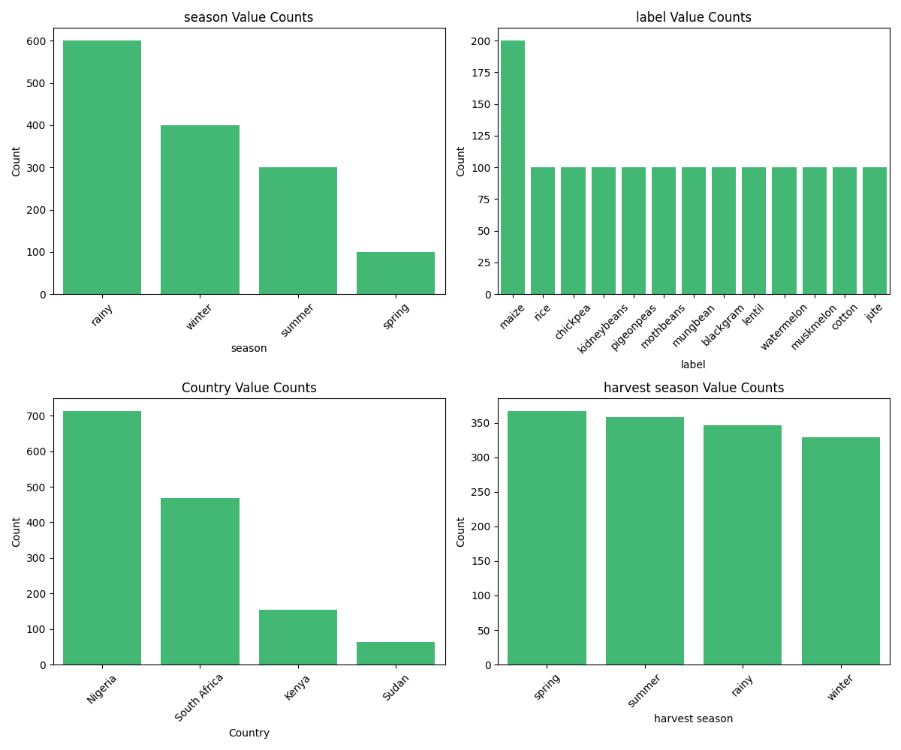
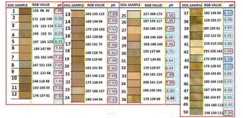

# MavunoX Data Science and ML
## Description

Welcome to the Data Science component of the MavunoX project! This machine learning system is dedicated to predicting the harvest season by analyzing a myriad of environmental factors. MavunoX is a comprehensive initiative focused on leveraging technology for sustainable agriculture, and this Data Science module plays a crucial role in optimizing crop yield predictions.

The Data Science/ML Project makes use of 3 models
- Main Model
- Soil pH Predictor
- Water Availabity model


## Main Model Architecture and Data Analysis

### Data Overview
The dataset, sourced from the [Klusterthon Hackathon](https://www.kluster.africa/problem-statements/precision-farming-for-best-product-results-with-data), provides valuable insights into environmental factors influencing harvest seasons across four countries: Nigeria, South Africa,Kenya, and Sudan. Essential features include temperature, humidity, pH, water availability, crop type, and the target label - the harvest season.

### Data Analysis

Our preliminary analysis revealed several key observations:

- **Most Common Season:** The dataset predominantly consists of data from the rainy season.

- **Dominant Crop:** Maize emerged as the most frequently occurring crop in the distribution.

- **Regional Concentration:** The majority of the dataset originates from the Nigerian region, showcasing a notable geographical focus.




### Data Preprocessing

To prepare the data for model training, we executed the following preprocessing steps:

- **Dropping Unnecessary Columns:** The "harvest season" column was removed, as it is not needed, and "temperature" was excluded to prevent data leakage.

- **Feature Engineering:** We created a new variable, the "ph_to_water_availability_ratio," to capture additional insights.

- **One-Hot Encoding:** Categorical variables ('Country' and 'label') were one-hot encoded for compatibility with machine learning models.

### Model Training

The XGBoost classifier was employed to predict harvest seasons based on the provided features. The model training process involved label encoding the target variable ('season') and splitting the data into training and testing sets.

### Model Evaluation

The trained model demonstrated promising results on the test set:

- **Accuracy:** The model achieved an accuracy of 89%.

- **Precision, Recall, and F1-Score:**

    |       | Precision | Recall | F1-Score | Support |
    |-------|-----------|--------|----------|---------|
    | 0     | 0.85      | 0.90   | 0.88     | 117     |
    | 1     | 1.00      | 1.00   | 1.00     | 20      |
    | 2     | 1.00      | 1.00   | 1.00     | 62      |
    | 3     | 0.84      | 0.78   | 0.81     | 81      |

    - **Accuracy:** 89%
    - **Macro Avg Precision:** 92%
    - **Macro Avg Recall:** 92%
    - **Macro Avg F1-Score:** 92%

These results suggest that the model is effective in predicting harvest seasons based on environmental factors.

For a more in-depth analysis and visualizations, please refer to the associated [Notebook](mavanux-model-building.ipynb). If you have any questions or suggestions, feel free to reach out. 

## Soil pH Predictor Model

## Overview

The Soil pH Predictor model aims to predict soil pH based on soil color information, with the output serving as input to the main MavunoX model. The model is inspired by a research paper titled ["Determine the pH of Soil by Using Neural Network Based on Soil's Colour"](https://www.researchgate.net/publication/336681057_Determine_the_pH_of_Soil_by_Using_Neural_Network_Based_on_Soil's_Colour). However, our implementation utilizes a gradient boosting model, specifically XGBoost.

### Data Source

The dataset used in this model is derived from the aforementioned research paper. It consists of a mapping of RGB values to corresponding soil pH levels.



### Preprocessing

To prepare the RGB data for modeling, we performed preprocessing steps such as calculating ratios and introducing a hue component:

- Calculated ratios: R/G, G/B, and R/B
- Derived hue values using a conversion function

### Additional Features

In addition to the RGB features, we introduced supplementary color-related features:

- Saturation: Extracted from RGB values
- Brightness: Extracted from RGB values

### Modelling

The predictive model employed for soil pH prediction is based on the XGBoost regressor. It was trained on the RGB data to predict soil pH levels. Model performance was evaluated using cross-validation, with the root mean squared error (RMSE) used as the evaluation metric.

The average RMSE across folds was found to be 0.7049. The output from this model is subsequently utilized as input for the main MavunoX model predicting harvest seasons.

For a more comprehensive analysis and visualizations, please refer to the associated Jupyter notebook. Feel free to reach out with any questions or suggestions.

## Water Availability Model

### Overview

The Water Availability Model is designed to estimate water availability based on the grayscale representation of soil color. The model assumes a correlation between soil color and water content, employing a straightforward approach to interpret grayscale values.


It's important to note that this is a simple approach, and ongoing research is being conducted to enhance and refine the model.

## Implementation

The model takes RGB values as input, converts them to grayscale, and then estimates water availability. The grayscale value is interpreted as a measure of soil color, and the linear interpolation formula is applied to derive the water availability score.

```python
# Grayscale calculation
gray_scale = 1 - ((R * 0.299 + G * 0.582 + B * 0.114) / 255)

# Linear interpolation for water availability
water_availability = 25 + ((gray_scale - 0.12) * (250 - 25)) / (0.65 - 0.12)
```

## Future Enhancements

As mentioned, the model's simplicity leaves room for improvement. Ongoing research endeavors are focused on refining this approach, exploring more sophisticated techniques, and incorporating additional features to enhance the accuracy of water availability predictions.

Your feedback and suggestions are valuable as we continue to enhance the Water Availability Model within the MavunoX Data Science Project.

## Custom Recommendation Generator for Rural Farmers

## Overview

This project part utilizes the OpenAI GPT-3.5 Turbo API to generate custom recommendations for rural farmers. The recommendation generator takes into account specific farming factors, recommended ranges, current values, units, and the target crop. The goal is to provide succinct and dynamic recommendations tailored to the farmer's inquiry.


## Usage

The recommendation generator function (`rec_gen`) takes input related to a specific farming factor, its recommended range, current value, unit, and the target crop. It then communicates with the OpenAI GPT-3.5 Turbo API to generate a dynamic and concise recommendation for optimal yield.

```python
def rec_gen(factor, min, max, value, unit, crop):
    # Code to interact with the OpenAI GPT-3.5 Turbo API for recommendation generation
    # ...

# Example Usage
recommendation = rec_gen("Temperature", 25.5, 30.0, 28.2, "Celsius", "Rice")
print(recommendation)
```

## Note

I ensured that I complied with OpenAI's usage policies and guidelines when using the GPT-3.5 Turbo API. For detailed API documentation and additional features, refer to the [OpenAI API documentation](https://beta.openai.com/docs/).


## Model Deployment
# Model Deployment using FastAPI and Docker

## Overview

This project part utilizes FastAPI for building the API endpoints and Docker for containerization, making the deployment process efficient and scalable. The API offers endpoints for generating recommendations based on various agricultural factors and processing crop data.


## API Documentation

The API documentation is already available and accessible, Check out the [API Documentation](docs.md). To explore the available endpoints, parameters, and responses, simply visit [https://mavunox.onrender.com](https://mavunox.onrender.com).

The documentation includes details on:

- Recommendations Endpoints:
  - Temperature Recommendation
  - Humidity Recommendation
  - pH Recommendation
  - Water Availability Recommendation

- Data Processing Endpoints:
  - First Data Processing
  - Second Data Processing

For each endpoint, you will find information about the expected input data, parameters, and sample requests. Feel free to interact with the documentation to understand how to use each endpoint effectively.

If you have any questions or need further assistance, please don't hesitate to reach out.
